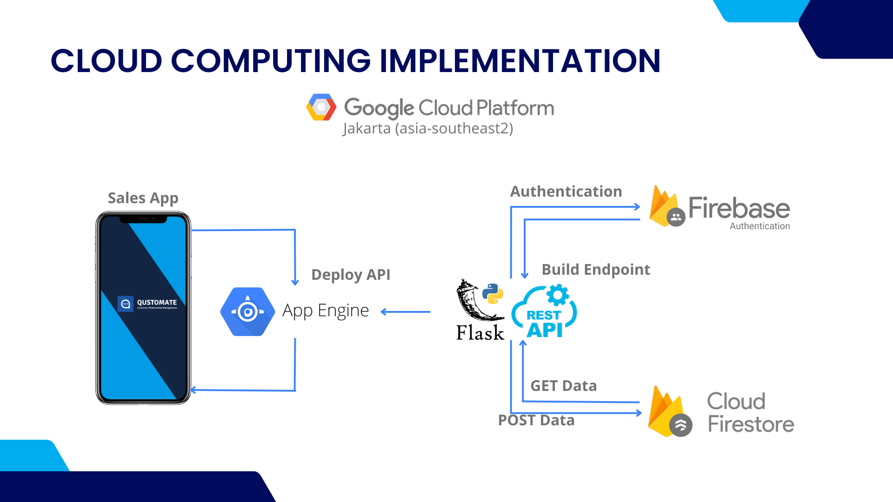

# 
Cloud Computing Documentation

## 1. git clone Qustomate repo & Install prequisite
      git clone https://github.com/Qustomate/Capstone-Project-Qustomate.git

## 2. Setup Firebase / Cloud Firestore to get auth tokens like service account and env

## 3. Setup Google Cloud Platform
- Setup and Enable App Engine

## 4. Run API in Cloud Shell Google Cloud Platform or Install SDK to run in VS Code
      gcloud app deploy

##    Cloud Computing Architecture
      

##    Qustomate API

<a href="api/README.md"><strong>Click here to see Qustomate API</strong></a>
