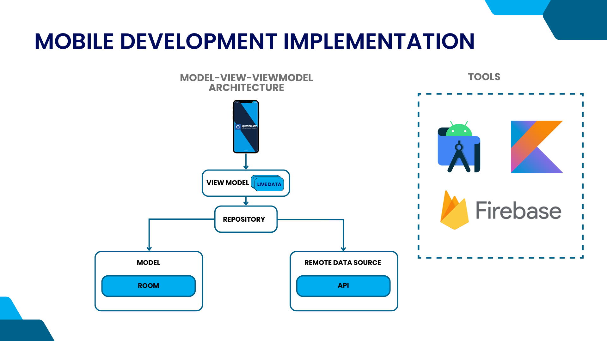

# <h1 align="center">Mobile Development</h1>

## 
Backgrounder

Create applications for MSME owners and their employees (sales). making applications is focused on employee use first. in the application there is a dashboard page to view sales performance (logged in users), incoming chat columns, client management, and also settings. in the dashboard there is a sentiment analysis chart to display positive or negative customer responses.

## 
Android Architecture

