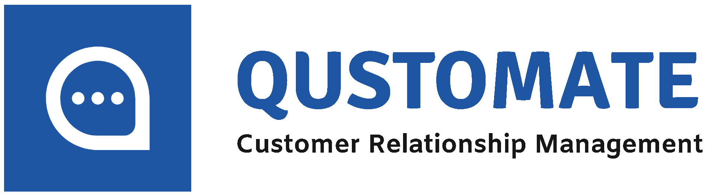

<!-- Qustomate -->

  
  <h2 align="center"><a href="https://github.com/Qustomate/Capstone-Project-Qustomate">Qustomate</a></h2>
  
Qustomate is a Customer Relationship Management (CRM) application developed by the C23-PR507 team and supported by <a href="https://grow.google/intl/id_id/bangkit/"><strong>Bangkit Academy led by Google, Tokopedia, Gojek, & Traveloka</strong></a>

  

    
    
    
    
    
    
  

  
© C23-PR507 Bangkit Capstone Team

# Team Members

## Team ID : C23-PR507
                   

 

| Name                   | Student ID  | Path                | Contact |
| ---------------------- | ----------  | ------------------- | ------- |
| Muhammad David         | M313DKX4618 | Machine Learning    |   |
| Muhammad Rey Renoult   | M312DKX4688 | Machine Learning    |   |
| Moh. Bayu Aji Prasetyo | M038DSX1879 | Machine Learning    |   |
| Ananda Satria Ariyanto | C172DSX1973 | Cloud Computing     |   |
| Isa Tarmana Mustopa    | C172DSX2370 | Cloud Computing     |   |
| Muh. Dhiyaul Haq       | A172DSX2077 | Android Development |   |

 

## Table of Contents
- [About The Project](#about-the-project)
- [App Overview](#app-overview)
- [Documentation](#documentation)
- [Thanks For Supported](#thanks-for-supported)

## About The Project

Lorem ipsum dolor sit amet, consectetur adipiscing elit. Phasellus tristique libero ut tellus malesuada sagittis. Aliquam in nibh commodo, semper sapien in, suscipit nunc. Proin efficitur enim id metus fringilla tristique. Sed id pretium nisi, at malesuada mauris. Nullam ultricies scelerisque ex, a faucibus nulla ultricies in. Vivamus sodales varius odio, eu luctus elit aliquam in. Donec vel vestibulum odio, non dictum odio. Aliquam gravida tellus justo, sed sagittis quam bibendum eget. Fusce ut ligula semper, rutrum risus at, malesuada magna. Suspendisse lacinia quam eu semper tristique. Integer consequat gravida felis, id sollicitudin lacus rutrum id. Fusce tincidunt congue elit, a faucibus nulla mattis sed. Cras tincidunt, nunc vitae cursus condimentum, sapien nulla posuere nisi, ac pulvinar felis felis id risus.

## App Overview

Lorem ipsum dolor sit amet, consectetur adipiscing elit. Phasellus tristique libero ut tellus malesuada sagittis. Aliquam in nibh commodo, semper sapien in, suscipit nunc. Proin efficitur enim id metus fringilla tristique. Sed id pretium nisi, at malesuada mauris. Nullam ultricies scelerisque ex, a faucibus nulla ultricies in. Vivamus sodales varius odio, eu luctus elit aliquam in. Donec vel vestibulum odio, non dictum odio. Aliquam gravida tellus justo, sed sagittis quam bibendum eget. Fusce ut ligula semper, rutrum risus at, malesuada magna. Suspendisse lacinia quam eu semper tristique. Integer consequat gravida felis, id sollicitudin lacus rutrum id. Fusce tincidunt congue elit, a faucibus nulla mattis sed. Cras tincidunt, nunc vitae cursus condimentum, sapien nulla posuere nisi, ac pulvinar felis felis id risus.

## Documentation
### Machine Learning
  <a href="https://github.com/Qustomate/Capstone-Project-Qustomate/tree/main/ML-models/Model-1">Machine Learning Documentation</a>
### Cloud Computing
  <a href="https://github.com/Qustomate/Capstone-Project-Qustomate/tree/main/Cloud%20Computing">Cloud Computing Documentation</a>
### Mobile Development
  <a href="">Mobile Development Documentation</a>

## Thanks For Supported

  <table>
    <tr>
      <td><a href="https://grow.google/intl/id_id/bangkit/"><strong>Bangkit Academy led by Google, Tokopedia, Gojek, & Traveloka</strong></a></td>
      <td><a href="https://www.gunadarma.ac.id/"><strong>Gunadarma University</strong></a></td>
      <td><a href="https://www.idu.ac.id/"><strong>Republic of Indonesia Defense University</strong></a></td>
      <td><a href="https://www.its.ac.id/id/beranda/"><strong>Sepuluh Nopember Institute of Technology</strong></a></td>
    </tr>
    <tr>
      <td></td>
      <td></td>
      <td></td>
      <td></td>
    </tr>
  </table>

### Mentor & Advisor
- <strong>Markus Andreas</strong> (Tech - Machine Learning/Data/AI, Tech - Android/Mobile Development, Project Management, Ideation/UI & UX Mentor)
- <strong>Muhammad Raihan Nismara</strong> (Tech - Cloud and Back End, Project Management, Ideation/UI & UX Mentor)
- <strong>Iqbal Ahmad Dahlan</strong> (Republic of Indonesia Defense University Advisor)
- <strong>Faturrahman Irwansa</strong> (CC-33 Mentor)
- <strong>Steven Adi Santoso</strong> (ML-52 Mentor)
- <strong>Mohammad Tauchid</strong> (CC-50 Mentor)
